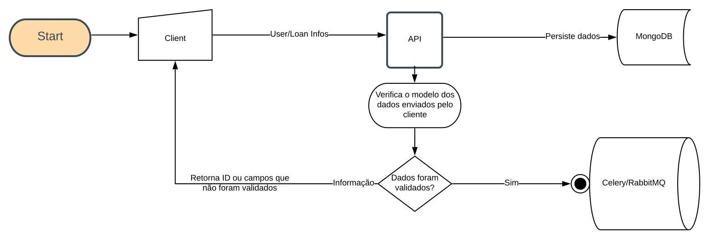
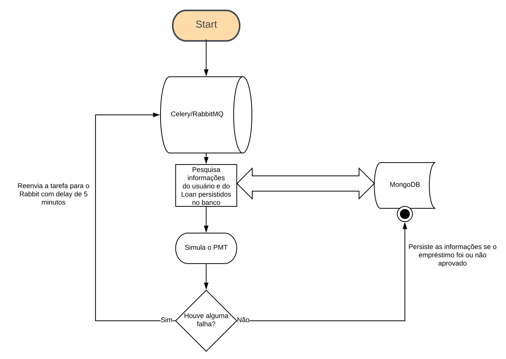
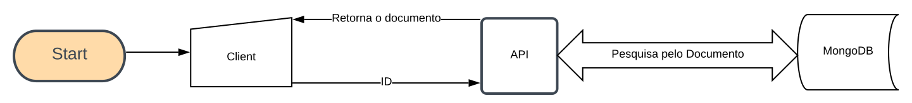

# Challenge

## Introdução

Simples demonstração de uso com Python, MongoDB, Celery/RabbitMQ e Docker.

## Sumário

- [Setup](#setup)
- [Enviando novo pedido](#enviando-novo-pedido)
- [Validação dos dados](#validação-dos-dados)
- [Verificando o status do processamento de um Loan](#verificando-o-status-do-processamento-de-um-loan)
- [Ciclo de vida do projeto](#ciclo-de-vida-do-projeto)
- [Testes](#testes)
- [Mantendo as boas práticas de escrita](#mantendo-as-boas-práticas-de-escrita)
- [Observações](#observações)
- [Dependências do projeto](#dependências-do-projeto)

## Setup

Primeiro precisamos montar nosso ambiente que irá receber as requests. Este projeto, possui um arquivo de nome `Makefile` ([README](./doc/makefile/README.md) com todos os comandos disponíveis) com diversas
regras, que facilitam não só o desenvolvimento/manutenção, assim como o deploy do mesmo.

Para preparar a aplicação, você pode digitar no terminal o comando `make up`, o qual irá instalar todas as dependências para
que a api possa receber requisições, e subir a aplicação e garantir a comunicação entre os elementos necessário.

__Obs.:__ 


- Caso ocorra algum erro de permissão ao criar os containers `PermissionError: [Errno 13] Permission denied: '/path/challenge/.mongodb/journal`, 
você ou pode verificar se o seu `docker` está listado no grupo de administradores, ou então rodar o comando `make sbuild` (irá pedir sua senha root).


- O comando `make sbuild` não leva em consideração o `linter` e os `testes` do projeto. Este deve ser usado para desenvolvimento. Em produção/CI, utilizar o comando `make build-prod` ou 
`make sbuild-prod`, pois o `linter` e os testes serão executados. 

## Enviando novo pedido

O processo inicia com  cliente enviando as informações para a api `http://localhost:5000/loan` ( via `POST`), 
a qual é protegida por uma `api-key` de valor `VmVyeSBBd2Vzb21lIEFwbGljYXRpb24gZG9uZSB3aXRoIGhlYXJ0`, que deve ser enviada no `header` da requisição.

Os campos que devem ser enviados em uma requisição, são:

- `name`: String -> nome do cliente;
- `cpf`: String -> CPF do cliente no formato `123.456.789-00` ou `12345678900`;
- `birthdate`: String -> A data de nascimento no formato `yyyy-mm-dd`, `yyyy/mm/dd` ou `dd/mm/yyyy`;
- `amount`: Decimal -> Valor desejado, entre R$ 1.000,00 e R$ 4.000,00;
- `terms`: Integer -> Quantidade de parcelas desejadas. Valores disponíveis: 6, 9 ou 12;
- `income`: Decimal -> Renda do cliente.


Exemplo de uma requisição válida com retorno `id` do documento inserido no banco:


```
import requests

url = "http://0.0.0.0:5000/loan"

payload = {
    'name': 'João',
    'cpf': '12345678900',
    'birthdate': '2005-08-15',
    'amount': 4000.00,
    'income': 1500.00,
    'terms': 6
}

headers= {'api-key': 'VmVyeSBBd2Vzb21lIEFwbGljYXRpb24gZG9uZSB3aXRoIGhlYXJ0'}

response = requests.request("POST", url, headers=headers, data=payload)
print(response.json()) # {'id': 'uuid-gerado-na-requisição'}
```

O retorno do id é instantâneo, e o id é inserido na fila para processamento em background.

## Validação dos dados

Devido a serem dados sensíveis e de extrema importância na continuidade do processo, os dados informados pelo cliente
são checados **duas** vezes.

- **Primeira checagem**:

Esta irá verificar se na requisição foram enviados todos os fields requeridos para iniciar um processo.
Nesta etapa, o código também irá verificar se todos os campos estão com seus respectivos tipos corretamente setados, como
por exemplo `name` deve ser uma `string` não vazia, assim como `amount` e `income` devem ser `decimal`, e assim por diante.

Exemplo de campos faltantes:

```
import requests

url = "http://0.0.0.0:5000/loan"

payload = {
    'name': 'João',
    'cpf': '12345678901',
    'birthdate': '1992-08-15',
}

headers= {'api-key': 'VmVyeSBBd2Vzb21lIEFwbGljYXRpb24gZG9uZSB3aXRoIGhlYXJ0'}

response = requests.request("POST", url, headers=headers, data = payload)

print(response.json())

# {
#   'errors': 
#       [
#           {'amount': 'Field is Required.'},
#           {'income': 'Field is Required.'},
#           {'terms': 'Field is Required.'}
#       ]
# }
```

Exemplo com campo com formato incorreto:

```
import requests

url = "http://0.0.0.0:5000/loan"

payload = {
    'name': 'João',
    'cpf': '12345678901',
    'birthdate': '1992-08-15',
    'amount': 2000.00,
    'income': 900.00,
    'terms': 'abc',
}

headers= {'api-key': 'VmVyeSBBd2Vzb21lIEFwbGljYXRpb24gZG9uZSB3aXRoIGhlYXJ0'}

response = requests.request("POST", url, headers=headers, data = payload)

print(response.json()) # {'errors': [{'terms': 'Invalid Format'}]}
```

- **Segunda checagem**:

Esta etapa irá verificar a congruência dos dados que serão inseridos, como por exemplo se os `termos` estão no valor permitido (definido no contrato), 
ou se o `amount` esta na faixa correta, ou qualquer outro problema que o modelo encontrar na validação.

```
import requests


url = "http://0.0.0.0:5000/loan"

payload = {
    'name': 'João',
    'cpf': '12345678901',
    'birthdate': '1992-08-15',
    'amount': 5000.00,
    'income': 900.00,
    'terms': 7,
}

headers= {'api-key': 'VmVyeSBBd2Vzb21lIEFwbGljYXRpb24gZG9uZSB3aXRoIGhlYXJ0'}

response = requests.request("POST", url, headers=headers, data = payload)

print(response.json())

# {
#   'errors': 
#        [
#            {"amount": "The amount must to be between 1000.00 - 4000.00"},
#            {"terms": "The terms not in [6, 9, 12]"},
#        ]
# }

```

## Verificando o status do processamento de um Loan

Após a api retornar o ID do documentos que será processado em background, nós já podemos monitorar e pesquisar por este documento no banco
a qualquer momento; para isso devemos utilizar o endpoint `/loan/:id`:

Exemplo de utilização:

```
import requests

res = requests.get("http://0.0.0.0:5000/loan/e2e0049e-c19b-11ea-a4fe-0242ac170005")
print(res.json())

# {
#   '_id': 'e2e0049e-c19b-11ea-a4fe-0242ac170005',
#   'amount': 4000.0,
#   'metadata': {'commitment': 0.39, 'score': 840},
#   'refused_policy': None,
#   'result': 'approved',
#   'status': 'completed',
#   'terms': 12
# }
```

**Ps.:** Note que tomei a liberdade de adicionar o campo `metadata` na Spec do modelo. Julguei que seria interessante manter alguns dados
para visualização futura. Esse campo pode conter informações úteis sobre o `Loan`, como também informações sobre possíveis erros de processamento. 


## Ciclo de vida do projeto


- **API**





- **Background**





- **Verificar status**





## Testes

Todos os testes estão na pasta `test/`. **Para realização dos testes, é necessário que todas as dependências dev estejam instaladas**, para isso
utilize o o comando `make setup-dev` ou  `pipenv install --dev` 

Para realizalçao dos testes foram utilizados `pytest`, `pytest-cov`, `snapshottest`, `unittest`, `responses` e `mongomock`

### Teste unitário

Para rodar os testes unitários, o processo é simples:

- No root do projeto, digite `make test`. Esse comando irár rodar todos os testes disponíveis.
- Caso o resultado de algum teste mudou, e esta correto, você pode utilizar `make snapshot-update` para atualizar os snapshots.


Para verificar a `cobertura` dos testes:

- Digite `make test-cov` e este irá rodar os testes novamente, e salvar os resultados dentro da pasta `htmlcov`.
- Caso utilize o `google chrome` digite `make html-coverage`, e uma página web será aberta com o resultados dos testes.

### Teste End-To-End


O teste End-to-End envia informações reais para o servidor, para tornar o teste mais realista e verificar a confiabilidade do sistema. Para isso é necessário que o servidor
esteja ativado ( `make up` ) e as dependências do projeto estejam instaladas em sua máquina ( `make setup-dev` ou `pipenv install --deploy --system --dev` ).

Com as especificações acima, basta entrar no root do projeto e digitar:

- `make e2e`

Os testes serão realizados, e as informações serão mostradas na tela se o teste passou ou não, ou se houve algum erro.

Obs.: Após o fim de cada teste, os registros gerados, são apagados do banco. O ideal desse teste, seria rodar na branch `Stage`, o qual deve simular o sistema real, porém não tem 
integração com a aplicação real. Esse teste está preparado para receber paramêtros diferentes de url e api key, via variáveis de ambiente.


### Vistoriando o background

Para vistoriar os eventos enviados para o background e seu processamento, você pode acessar o `flower`, acessando este link: http://localhost:5555/tasks


## Mantendo as boas práticas de escrita

Existem algumas regras no `Makefile` que utilizam de ferramentas para ordenar os `imports`, verificar escrita, e auto formatar o código.

Os dois principais são:

- `make lint` -> funciona como linter do código, verificando por melhorias na escrita
- `make format` -> Auto formata o código, ordenando imports e fazendo outras melhorias. 

## Observações

- O MongoDB foi escolhido como banco, pela proximidade do DynamoDB, o qual foi solicitado como bônus no projeto.
- Este projeto foi desenvolvido com foco em ambiente servless, com o uso de algum orquestrador (Kubernetes) ou gerenciadores de API (API Gateway).
- Como é apenas para provar conceitos técnicos, não separei este projeto. Porém, se esta aplicação fosse real, este projeto deveria ser melhor dividido:
    - Um projeto para a api;
    - Outro projeto para o Backend;
    - O Banco de Dados dados deveria ter uma instância única e exclusiva para ele.


## Dependências do projeto

### Produção

- flask
- gunicorn
- celery
- ampq
- pymongo
- schematics
- pandas
- python-dateutil
- requests
- backoff
- flower
- boto3 (Maybe if using AWS lambda)


### Desenvolvimento

- pytest
- pytest-cov
- snapshottest
- autoflake
- mypy
- responses
- isort
- black
- flake8
